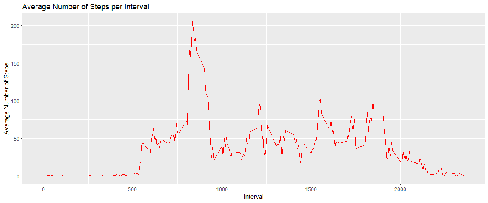
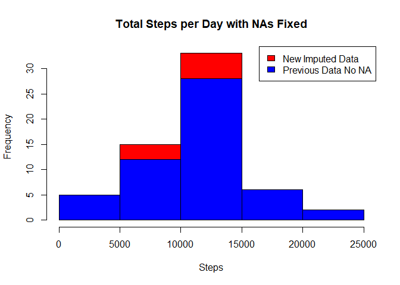
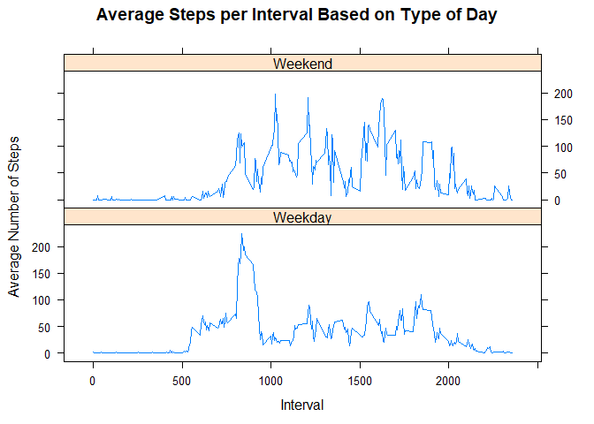

## Loading and preprocessing the data
### 0.1. Download the data to your working directory. Then unzip it and obtain the csv


```r
unzip("activity.zip",exdir = "Project1")
```

### 0.2. Reading the data into activity data frame and show some summary statistics

```r
activity <- read.csv("Project1/activity.csv", stringsAsFactors=FALSE)
names(activity)
```

```
## [1] "steps"    "date"     "interval"
```

```r
str(activity)
```

```
## 'data.frame':	17568 obs. of  3 variables:
##  $ steps   : int  NA NA NA NA NA NA NA NA NA NA ...
##  $ date    : chr  "2012-10-01" "2012-10-01" "2012-10-01" "2012-10-01" ...
##  $ interval: int  0 5 10 15 20 25 30 35 40 45 ...
```

```r
summary(activity)
```

```
##      steps            date              interval     
##  Min.   :  0.00   Length:17568       Min.   :   0.0  
##  1st Qu.:  0.00   Class :character   1st Qu.: 588.8  
##  Median :  0.00   Mode  :character   Median :1177.5  
##  Mean   : 37.38                      Mean   :1177.5  
##  3rd Qu.: 12.00                      3rd Qu.:1766.2  
##  Max.   :806.00                      Max.   :2355.0  
##  NA's   :2304
```

### 0.3. Processing data

```r
activity$day <- weekdays(as.Date(activity$date))
activity$DateTime<- as.POSIXct(activity$date, format="%Y-%m-%d")
ActivityClean <- activity[!is.na(activity$steps),]
```

## 1. What is mean total number of steps taken per day?
### 1.1 Calculate the total number of steps taken per day 

```r
stepDay <- aggregate(activity$steps ~ activity$date, FUN=sum )
colnames(stepDay)<- c("Date", "Steps")
```

### 1.2 Creating the historgram of total steps per day

```r
hist(stepDay$Steps, breaks=5, col = "blue", xlab="Steps", main = "Total Steps per Day")
```

<!-- -->

### 1.3 Mean and median of total number of steps per day

```r
Mean<- as.integer(mean(stepDay$Steps))
Mean
```

```
## [1] 10766
```

```r
Median<- as.integer(median(stepDay$Steps))
Median
```

```
## [1] 10765
```

## 2. What is the average daily activity pattern?
### 2.1. Make a time series plot (i.e. type = "l") of the 5-minute interval (x-axis) and the average number of steps taken, averaged across all days (y-axis)  

```r
library(plyr)
library(ggplot2)

dailyavg <- ddply(ActivityClean, .(interval), summarize, Avg = mean(steps))
p <- ggplot(dailyavg, aes(x=interval, y=Avg), xlab = "Interval", ylab="Average Number of Steps")
p + geom_line(color="red")+xlab("Interval")+ylab("Average Number of Steps")+ggtitle("Average Number of Steps per Interval")
```

<!-- -->

### 3 Which 5-minute interval, on average across all the days in the dataset, contains the maximum number of steps?

```r
maxSteps <- max(dailyavg$Avg)
dailyavg[dailyavg$Avg==maxSteps,1]
```

```
## [1] 835
```

##4.  Imputing missing values
### 4.1. Calculate and report the total number of missing values in the dataset (i.e. the total number of rows with NAs)


```r
na_number <- sum(is.na(activity$steps))
na_number
```

```
## [1] 2304
```
Total number of missing values in the dataset amounts to **2304 ** 

### 4.2. Devise a strategy for filling in all of the missing values in the dataset
Substitute the missing steps with the average 5-minute interval and hope no mayor deviation

#### 4.3 Create the average number of steps per weekday and interval, dataset with all NAs, and the average for substitution

```r
Tableavg <- ddply(ActivityClean, .(interval, day), summarize, Avg = mean(steps)) 
nadata<- activity[is.na(activity$steps),]
newdata<-merge(nadata, Tableavg, by=c("interval", "day"))
```

### 4.4. Create a new dataset that is equal to the original dataset but with the missing data filled in.

### 4.5 Reorder the new data set as the clean one and merge them

```r
newdata2<- newdata[,c(6,4,1,2,5)]
colnames(newdata2)<- c("steps", "date", "interval", "day", "DateTime")
mergeData <- rbind(ActivityClean, newdata2)
str (mergeData)
```

```
## 'data.frame':	17568 obs. of  5 variables:
##  $ steps   : num  0 0 0 0 0 0 0 0 0 0 ...
##  $ date    : chr  "2012-10-02" "2012-10-02" "2012-10-02" "2012-10-02" ...
##  $ interval: int  0 5 10 15 20 25 30 35 40 45 ...
##  $ day     : chr  "martes" "martes" "martes" "martes" ...
##  $ DateTime: POSIXct, format: "2012-10-02" "2012-10-02" ...
```

### 4. Make a histogram of the total number of steps taken each day and Calculate and report the mean and median total number of steps taken per day

### 4.1 Create sum of steps per date to compare with step 1

```r
Table2 <- aggregate(mergeData$steps ~ mergeData$date, FUN=sum)
colnames(Table2)<- c("Date", "Steps")
```
### 4.2 Mean and median of Steps with NA data

```r
newMean<- as.integer(mean(Table2$Steps))
newMean
```

```
## [1] 10821
```

```r
newMedian<- as.integer(median(Table2$Steps))
newMedian
```

```
## [1] 11015
```

### 4.3 Creating the histogram of total steps per day, categorized by data set to show impact

```r
hist(Table2$Steps, breaks=5, xlab="Steps", main = "Total Steps per Day with NAs Fixed", col="red")
hist(stepDay$Steps, breaks=5, xlab="Steps", main = "Total Steps per Day with NAs Fixed", col="Blue", add=T)
legend("topright", c("New Imputed Data", "Previous Data No NA"), fill=c("red", "blue") )
```

<!-- -->

New mean of steps is 10821 steps and the old mean is 10766 steps. A difference of 55 steps on average per day.

New median of steps is 11015 steps and the old one was 10765 steps. A difference of 250 steps for the median.

## 5. Are there differences in activity patterns between weekdays and weekends?
### 5.1 Create new category based on the days of the week


```r
mergeData$DayCategory <- ifelse(mergeData$day %in% c("sabado", "domingo"), "Weekend", "Weekday")
```

### 5.2 Make a panel plot containing a time series plot (i.e. type = "l") of the 5-minute interval (x-axis) and the average number of steps taken, averaged across all weekday days or weekend days (y-axis).


```r
library(lattice)
```

#### 5.2.1 Summarize data by interval and type of day and plot

```r
intervalTable2 <- ddply(mergeData, .(interval, DayCategory), summarize, Avg = mean(steps))
xyplot(Avg~interval|DayCategory, data=intervalTable2, type="l",  layout = c(1,2),
       main="Average Steps per Interval Based on Type of Day", 
       ylab="Average Number of Steps", xlab="Interval")
```

<!-- -->
